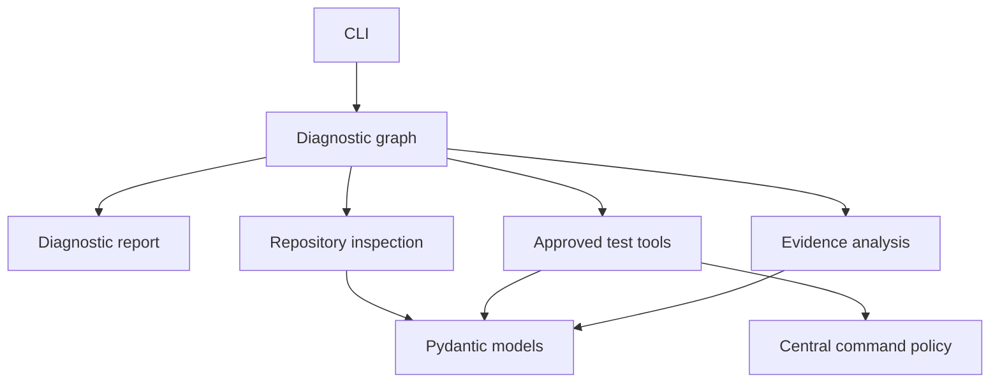
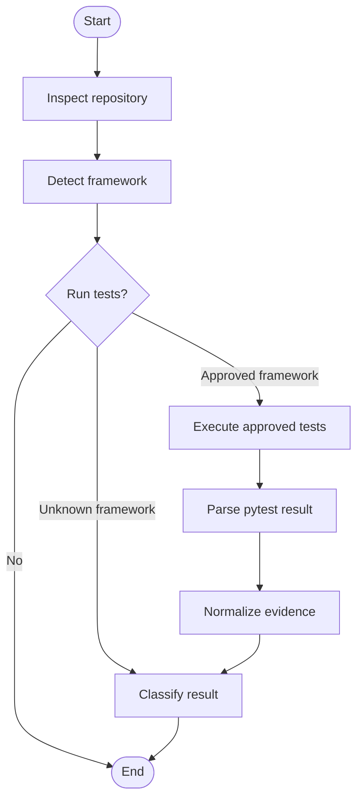

# Agent-Ops Architecture

## Status and Scope

Agent-Ops is currently a local-first, repository-aware diagnostic system. The
implemented workflow inspects a repository, detects a supported test framework,
optionally runs an explicitly approved test command, normalizes the captured
evidence, and classifies the result with deterministic rules.

This document describes both the implemented foundation and the architectural
boundaries for planned capabilities. Planned components are identified explicitly;
they must not be treated as existing behavior.

## Architectural Principles

1. **Evidence before interpretation.** Preserve raw execution evidence before
   parsing, normalization, classification, or recommendation generation.
2. **One coordinating workflow.** A single LangGraph workflow owns routing and
   state transitions. Focused Python modules perform repository inspection,
   execution, parsing, classification, and reporting.
3. **Deterministic local analysis first.** Explicit rules handle high-confidence
   cases before any future model-assisted analysis.
4. **Read-only by default.** Repository inspection is non-mutating. Test execution
   occurs only when the user requests it and an approved command is available.
5. **Structured contracts.** Pydantic models represent captured evidence and public
   results. Important state must not exist only in free-form text.
6. **Reviewable side effects.** Future patches or external mutations require a
   separate approval boundary and must remain reversible.
7. **Vendor-neutral core.** Persistence, tracing, and evaluation must work without
   a required hosted service. External integrations are optional adapters.

The coordinating-agent decision is recorded in
[`decisions/001-single-agent-first.md`](decisions/001-single-agent-first.md).

## Implemented Components

### Command-line interface

`agent_ops.cli` parses the repository path and the explicit `--run-tests` option,
invokes the compiled graph, builds an immutable public diagnostic report, and
serializes the supported result fields as JSON. Optional report sections are emitted
only when the graph produced them. The default path does not run tests.

### Workflow orchestration

`agent_ops.workflow` contains the LangGraph state, nodes, routing, and graph
construction. Nodes are intentionally thin: they call independently testable
domain functions and return state updates.

The implemented graph is:

The graph currently compiles without a checkpointer. Durable checkpoints, resume,
time travel, streaming, and human interrupts are planned orchestration features.

### Repository intelligence

`agent_ops.repository` scans repository metadata and detects supported test
frameworks. Pytest is the initial supported framework. Detection returns a
structured profile containing confidence, evidence, and an approved command when
one can be selected safely.

### Tool execution and safety

`agent_ops.tools` executes the approved command and captures its command tuple,
exit code, standard output, standard error, duration, and timeout state.
`agent_ops.safety` owns the exact framework-and-command allowlist used by framework
detection, the execution boundary, and offline safety evaluation. The test runner
requires a successful policy decision before constructing the runtime command or
calling `subprocess.run`. Repository-path validation remains at the execution
boundary. Arbitrary shell strings are not part of the execution contract.

The versioned command-safety corpus exercises the policy without launching any
subprocess. It includes the one currently approved pytest tuple alongside missing,
modified, shell-mediated, and unsupported-framework commands. Any incorrect policy
decision fails the command-safety evaluation gate.

The command decision is recorded in
[`decisions/002-approved-commands-only.md`](decisions/002-approved-commands-only.md).

### Evidence analysis

`agent_ops.analysis` separates four responsibilities:

1. Parse recognizable pytest result information.
2. Extract conservative local details such as exception types and traceback paths.
3. Normalize execution and parser output into one evidence model.
4. Classify the normalized evidence using explicit ordered rules.

Parsing does not execute commands, and classification does not re-read subprocess
output. This separation keeps each transformation deterministic and independently
testable.

### Domain models

`agent_ops.models` contains immutable Pydantic models for repository profiles,
framework detection, execution evidence, parsed summaries, normalized evidence,
failure classifications, and the public diagnostic report. Models forbid unexpected
fields where the schema is controlled and validate counts, durations, and confidence
ranges.

### Evaluation

`agent_ops.evaluation` contains the deterministic evaluation runner and metric
functions. `evals/` contains the versioned reference dataset and executable local
entry point. The initial baseline measures classification, abstention, evidence,
latency, and category confusion without external services. Validated reports can be
written as JSON and compared across immutable system versions. The comparison layer
records per-case regressions and improvements, metric deltas, and a deterministic
no-regression gate. Evaluation is described in
[`repository_aware_evaluation.md`](repository_aware_evaluation.md).

## State and Evidence Boundaries

The graph state is transient orchestration state. It currently contains:

- repository path and execution intent;
- repository and framework profiles;
- captured test execution;
- parsed test summary;
- normalized execution evidence; and
- failure classification.

These concepts should remain distinct as persistence is added:

| Concern | Responsibility |
| --- | --- |
| Graph state | Values required to continue the current workflow |
| Checkpoint | Durable version of graph state and its next permitted operation |
| Evidence store | Raw logs, traces, screenshots, and other potentially large artifacts |
| Trace | Historical record of nodes, tools, timing, approvals, and outcomes |
| Evaluation result | Comparison of one system version against reference expectations |

Large artifacts should not be copied into every checkpoint. A checkpoint should
contain stable evidence references plus the provenance needed to interpret them.

## Planned Durable Orchestration

When the workflow becomes long-running or approval-driven, persistence should add:

- a stable diagnostic run identifier;
- repository identity and commit SHA;
- workflow, classifier, prompt, and model versions when applicable;
- current stage and next permitted operation;
- evidence references;
- approval state;
- error or interruption information; and
- monotonically ordered state transitions.

SQLite is the preferred first durable checkpointer for local operation. A deployed,
concurrent service may later use PostgreSQL. In-memory persistence is appropriate
only for tests and demonstrations.

Time-travel execution must create a new branch without deleting the original run.
Returning to a checkpoint does not reverse real-world side effects. Any replayable
node that can mutate external state must be idempotent or require renewed approval.

## Planned Streaming and Observability

Streaming should expose concise domain events rather than unrestricted graph state.
An event will identify the diagnostic run, sequence, timestamp, stage, status,
summary, and evidence references. The existing final JSON response remains the
default public CLI contract; any streaming mode must be explicit and backward
compatible.

Tracing should record node and tool inputs, outputs, latency, errors, retries,
approvals, token use, cost, and version provenance where applicable. Sensitive
repository content and secrets must be redacted before export. Local tracing is the
default direction; LangSmith or another hosted platform may be supported through an
optional exporter.

## Planned Human-Reviewed Corrections

Patch generation is not part of the current implementation. A future correction
workflow may:

1. Produce an evidence-supported candidate change.
2. Present the explanation and unified diff for review.
3. Pause for explicit human approval.
4. Apply the approved change in an isolated workspace.
5. Run focused tests followed by appropriate regression checks.
6. Compare the verified outcome with the original baseline.
7. Preserve the complete decision and execution history.

Agent-Ops must not merge changes automatically.

## Multi-Agent Boundary

Agent-Ops remains a single coordinated workflow. Parallel graph nodes may process
independent evidence without becoming independent conversational agents. Specialist
agents should be considered only when several evidence sources or candidate patches
can be analyzed independently and their value exceeds the cost of routing, shared
state, conflict resolution, and additional evaluation.

If specialists are introduced, the coordinator retains approval control and final
report ownership. Specialists return structured findings and do not mutate shared
state directly.
